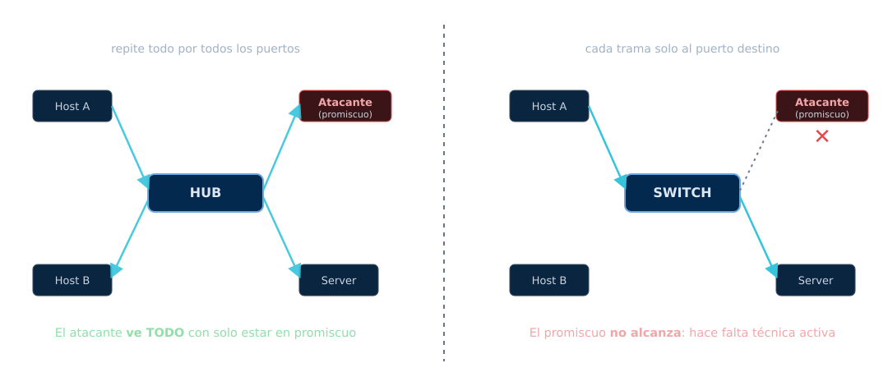
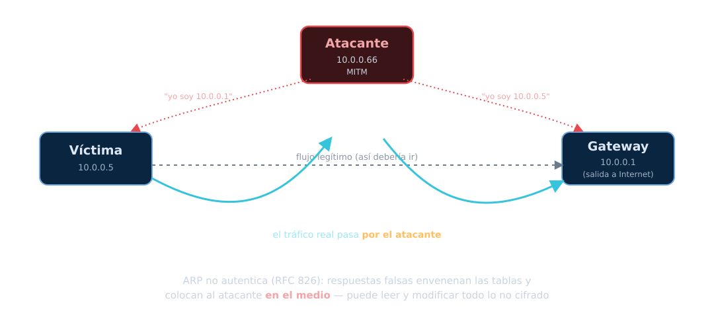
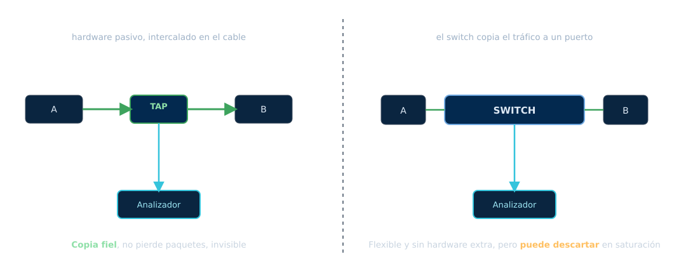

<!-- _class: portada -->
<!-- _paginate: false -->
<!-- _footer: '' -->

# Sniffing
## Unidad 4 — Análisis de tráfico de red

<div class="meta">ARyS · IF046 · UNPSJB Trelew · 2026</div>

<!--
Nota del docente:
Retomamos el cierre de la U3: "profundiza el análisis de tráfico".
El eje moderno de esta unidad es que hoy CASI TODO viaja cifrado, y eso
cambió para qué sirve sniffear. Empezar por el encuadre legal.
-->

---

## De escanear a escuchar

En la **Unidad 3** aprendimos a **mapear** la red: qué hosts, qué puertos, qué
servicios.

Ahora nos ponemos a **escuchar** lo que circula por ella.

<div class="nota red"><span class="rot">El salto</span>
El escaneo pregunta "¿qué hay?". El sniffing escucha "¿qué se está diciendo?".
Es la diferencia entre golpear puertas y poner el oído en la pared.</div>

---

## ¿Qué es el sniffing?

**Capturar y analizar** el tráfico que circula por una red.

<div class="cols">
<div>

### Usos legítimos
- Diagnóstico y *troubleshooting*
- Análisis de rendimiento
- Detección de intrusiones (IDS)
- Análisis forense

</div>
<div>

### Usos ofensivos
- Robo de credenciales en claro
- Secuestro de sesiones
- Espionaje de comunicaciones
- Mapeo interno de la red

</div>
</div>

<div class="nota"><span class="rot">La misma herramienta</span>
Wireshark lo usa el que defiende y el que ataca. Lo que cambia es la
<strong>autorización</strong> y la <strong>intención</strong>.</div>

---

## Primero, la ley

> Interceptar comunicaciones ajenas **sin autorización** es delito.

En Argentina, la **Ley 26.388** (delitos informáticos):

- Art. 153 — apertura/acceso indebido a comunicaciones electrónicas
- Art. 153 bis — acceso ilegítimo a un sistema informático

<div class="nota legal"><span class="rot">Regla de la unidad</span>
Solo sniffeamos <strong>tráfico propio o de una red que administramos con
autorización</strong>. Todo el práctico se hace en laboratorio aislado. Nunca
sobre la red de la facultad, un café o el vecino.</div>

---

## Pasivo vs. activo

<div class="cols">
<div>

### Pasivo
Solo **escucho**, no altero la red.

- Indetectable
- Depende de que el tráfico **llegue** a mi placa

</div>
<div>

### Activo
**Manipulo** la red para que el tráfico pase por mí.

- MAC flooding, ARP spoofing
- Deja rastro
- Necesario en redes conmutadas

</div>
</div>

<div class="nota red"><span class="rot">Por qué existe el activo</span>
Porque en una red moderna (switcheada) el tráfico ajeno <strong>no llega solo</strong>
a tu placa. Hay que forzarlo.</div>

---

## El modo promiscuo

Una placa de red **normal** descarta las tramas que no son para su MAC.

En **modo promiscuo**, la placa acepta **todas** las tramas que le llegan —sean
para ella o no— y se las pasa al sistema.

<div class="nota"><span class="rot">Condición necesaria…</span>
…pero <strong>no suficiente</strong>. El promiscuo captura lo que <em>llega</em> a la
placa. La pregunta clave es: en una red conmutada, ¿qué llega realmente?</div>

---

## Hub vs. Switch



---

## Sniffing activo (1): MAC flooding

El switch usa una tabla **CAM** (MAC → puerto) para saber a dónde mandar cada trama.
Esa tabla tiene **capacidad limitada**.

- El atacante la **satura** con miles de MAC falsas
- Al desbordarse, muchos switches entran en **fail-open**: reenvían por todos los
  puertos… **como un hub**
- Y ahí el sniffing pasivo vuelve a funcionar

<div class="nota amenaza"><span class="rot">Fundamento</span>
El reenvío del switch está definido en <strong>IEEE 802.1D</strong>. El ataque
explota que la tabla CAM es finita.</div>

---

## Sniffing activo (2): ARP spoofing / MITM



---

## Por qué ARP es tan fácil de engañar

El protocolo **ARP** (resolución IP → MAC) **no tiene autenticación**.

- Cualquiera puede responder "esa IP soy yo"
- El atacante envenena las tablas de víctima y gateway
- Queda **en el medio** (*Man-in-the-Middle*): lee y puede **modificar** todo lo
  que no esté cifrado

<div class="nota amenaza"><span class="rot">Fuente</span>
ARP está definido en <strong>RFC 826</strong> (1982): pensado para una red
confiable, sin ninguna verificación de identidad.</div>

---

## Técnicas basadas en hardware



<div class="nota control"><span class="rot">Cuándo se usan</span>
Son los métodos <strong>legítimos</strong> del administrador para capturar tráfico:
monitoreo, IDS, forense. El TAP es el patrón de referencia por fidelidad.</div>

---

## Herramientas (1): la línea de comandos

**tcpdump** / **tshark** — captura y filtrado desde la terminal, ideal para
servidores sin entorno gráfico.

```bash
# Capturar en la interfaz eth0 y guardar a un archivo
sudo tcpdump -i eth0 -w captura.pcap

# Filtrar solo tráfico HTTP hacia/desde un host
sudo tcpdump -i eth0 host 10.0.0.5 and port 80

# Leer un pcap y ver el contenido
tcpdump -r captura.pcap -A
```

<div class="nota"><span class="rot">Formato universal</span>
El <strong>.pcap</strong> es el formato estándar: lo captura tcpdump y lo abre
Wireshark. Capturás en un lado, analizás en otro.</div>

---

## Herramientas (2): Wireshark

El analizador gráfico de referencia. Diseca cada paquete capa por capa.

- **Filtros de visualización** potentes: `http`, `ip.addr == 10.0.0.5`, `tcp.port == 443`
- **Follow TCP stream**: reconstruye una conversación completa
- Estadísticas, gráficos de flujo, exportación de objetos

<div class="nota control"><span class="rot">Del lado defensivo</span>
Es la herramienta que más vas a usar para <strong>entender</strong> qué pasa en una
red — tanto para diagnosticar un problema como para investigar un incidente.</div>

---

## Herramientas (3): bettercap

El *"navaja suiza"* moderno del MITM. Sucesor espiritual de **ettercap**.

- ARP spoofing, sniffing, manipulación de tráfico, módulos Wi-Fi/BLE
- Escriteable y automatizable

```bash
# Poner a la víctima y al gateway bajo ARP spoofing (LAB PROPIO)
sudo bettercap -iface eth0 -eval "set arp.spoof.targets 10.0.0.5; arp.spoof on; net.sniff on"
```

<div class="nota amenaza"><span class="rot">Solo laboratorio</span>
Herramienta legal de <strong>estudiar</strong> y usar en tu red aislada. Contra
terceros sin permiso: delito.</div>

---

<!-- _class: portada -->
<!-- _paginate: false -->
<!-- _footer: '' -->

# El gran cambio
## Hoy casi todo viaja cifrado

<div class="meta">Y eso cambió para qué sirve sniffear</div>

---

## TLS 1.3: qué ve y qué no ve el sniffer

Con **TLS 1.3**, gran parte del handshake y **todo el contenido** viajan cifrados.

<div class="cols">
<div>

### Todavía ve (metadatos)
- IPs y puertos
- Tamaños y tiempos de paquetes
- (hasta hace poco) el **SNI**

</div>
<div>

### Ya NO ve
- URLs, cookies, formularios
- El certificado del servidor
- El contenido de la aplicación

</div>
</div>

<div class="nota"><span class="rot">Fuente</span>
TLS 1.3 — <strong>RFC 8446</strong> (2018). El sniffing de contenido en claro es,
cada vez más, cosa del pasado.</div>

---

## ECH: se cifra el último dato en claro

El **SNI** (*Server Name Indication*) era lo último que viajaba en claro: revelaba
**a qué sitio** te conectabas, aunque el resto estuviera cifrado.

**Encrypted Client Hello (ECH)** cifra el ClientHello completo bajo una clave
pública del servidor. Ya lo despliegan Cloudflare, Fastly, Akamai.

<div class="nota control"><span class="rot">Fuente</span>
ECH — <strong>RFC 9849</strong> (2026); antes circuló como
<code>draft-ietf-tls-esni</code>. Cierra la fuga de "qué dominio visitás".</div>

---

## DNS cifrado: DoT y DoH

El **DNS tradicional** viaja en claro (puerto 53): un sniffer ve **qué dominios
resolvés**, aunque después uses HTTPS.

- **DoT** — DNS sobre TLS, puerto 853 · **RFC 7858**
- **DoH** — DNS sobre HTTPS, puerto 443 (indistinguible del tráfico web) · **RFC 8484**

<div class="nota control"><span class="rot">El combo que cierra la puerta</span>
<strong>TLS 1.3 + ECH + DNS cifrado</strong>: el sniffer ya casi no sabe qué sitio
visitás ni qué intercambiás. Solo le quedan los metadatos.</div>

---

## El cambio de paradigma

Hoy **~95%** de las páginas cargadas en Chrome se sirven sobre **HTTPS**.

<div class="nota red"><span class="rot">Consecuencia</span>
El sniffing de <em>contenido</em> se volvió, en gran medida, sniffing de
<strong>metadatos</strong>: quién habla con quién, cuánto y cuándo — no qué dicen.</div>

Fuente: *Google Transparency Report — HTTPS encryption on the web* (consultado en 2026).

---

## Fingerprinting de tráfico cifrado

Si no puedo leer el contenido… **identifico al cliente por su forma**.

El **ClientHello** de TLS varía según la app/librería (versión, cifrados,
extensiones). Un **hash** de esos campos identifica software y malware **sin
descifrar**.

- **JA3** (Salesforce, 2017) — el pionero
- **JA4 / JA4+** (FoxIO) — evolución robusta, familia de fingerprints (TLS, HTTP,
  TCP, SSH…). Hoy es la referencia para *threat hunting* sobre tráfico cifrado

<div class="nota"><span class="rot">Idea clave</span>
La disciplina se corrió: de <em>leer el contenido</em> a <strong>reconocer patrones</strong>.</div>

---

## Sniffing en Wi-Fi

En Wi-Fi el modo relevante es el **monitor mode** (≠ promiscuo): captura **todas**
las tramas 802.11 del aire, incluidas las de gestión, sin estar asociado.

<div class="cols">
<div>

### WPA2
Se captura el **4-way handshake** y se ataca **offline** por diccionario.

</div>
<div>

### WPA3 (SAE)
El intercambio **SAE / Dragonfly** resiste el ataque offline: capturar el
handshake ya no basta.

</div>
</div>

<div class="nota amenaza"><span class="rot">Matiz honesto</span>
WPA3 no es invulnerable: los ataques <strong>Dragonblood</strong> (Vanhoef &amp; Ronen,
2020) mostraron canales laterales y <em>downgrade</em>. Base de SAE: RFC 7664 +
IEEE 802.11-2020 (no existe un "RFC de WPA3").</div>

---

## Defensas de capa 2

El sniffing activo se combate en el **switch**:

<div class="tarjetas">
<div class="t"><b>Port Security</b>Limita las MAC por puerto → frena MAC flooding.</div>
<div class="t"><b>DHCP Snooping</b>Bloquea servidores DHCP falsos; arma la base IP-MAC.</div>
<div class="t"><b>Dynamic ARP Inspection</b>Valida cada ARP contra esa base → frena ARP spoofing.</div>
<div class="t"><b>802.1X</b>Exige autenticación antes de dar acceso al puerto.</div>
</div>

<div class="nota control"><span class="rot">Fuentes</span>
Documentación oficial de switches (Cisco DAI / DHCP Snooping / Port Security);
802.1X es <strong>IEEE 802.1X-2020</strong>.</div>

---

## La defensa que siempre gana

Todas las defensas de capa 2 ayudan, pero pueden fallar o no estar.

La defensa **real** contra el sniffing es asumir que **la red es hostil** y
**cifrar de punta a punta**:

- HTTPS en todo (TLS), HSTS
- VPN / IPsec para tráfico interno sensible
- DNS cifrado

<div class="nota red"><span class="rot">Enganche</span>
Cómo funciona ese cifrado por dentro —simétrico, asimétrico, PKI— es toda la
<strong>Unidad 6 (Criptografía)</strong>. El sniffing es la mejor motivación para
entenderla.</div>

---

## Cerrando la unidad

1. Sniffing = **capturar y analizar** tráfico; misma herramienta, distinta ética
2. El **modo promiscuo** alcanza en hub, **no** en switch
3. En redes conmutadas hace falta **técnica activa**: MAC flooding, **ARP spoofing/MITM**
4. Técnicas de hardware: **TAP** y **port mirroring (SPAN)**
5. **Hoy todo está cifrado**: TLS 1.3 + ECH + DNS cifrado → del contenido a los **metadatos**
6. Nuevas técnicas: **fingerprinting** (JA3/JA4) sin descifrar
7. Se defiende en capa 2 (**DAI**, 802.1X) y, sobre todo, **cifrando extremo a extremo**

<div class="nota red"><span class="rot">Próxima unidad</span>
<strong>Unidad 5 — Firewall, IDS y Honeypot.</strong> Pasamos de escuchar la red a
<strong>controlarla y vigilarla</strong>: quién entra, quién sale y quién está espiando.</div>

---

<!-- _class: portada -->
<!-- _paginate: false -->
<!-- _footer: '' -->

# ¿Preguntas?

<div class="meta">Material: github.com/bzappellini/ARyS · Campus virtual UNPSJB</div>
