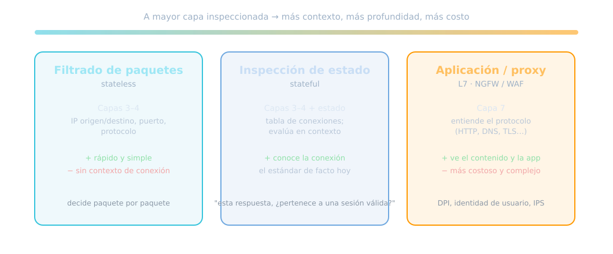
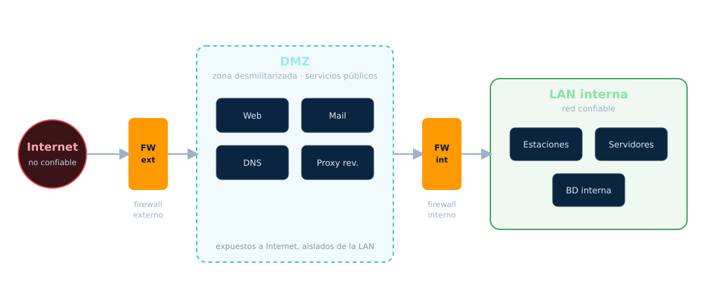
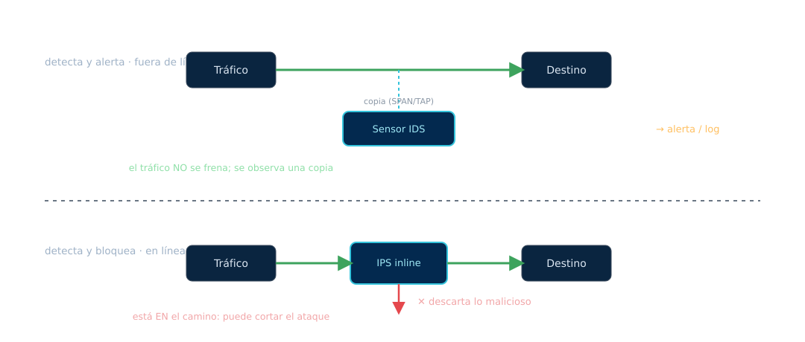

<!-- _class: portada -->
<!-- _paginate: false -->
<!-- _footer: '' -->

# Firewall, IDS y Honeypot
## Unidad 5 — Defender, detectar y engañar

<div class="meta">ARyS · IF046 · UNPSJB Trelew · 2026</div>

<!--
Nota del docente:
Retomamos el cierre de U4: pasamos de ESCUCHAR la red a CONTROLARLA y
VIGILARLA. Tres roles: firewall (controla), IDS/IPS (detecta), honeypot (engaña).
Aviso: las guías NIST de firewall/IDPS son normativas pero antiguas; usarlas
como marco y complementar con la doc de cada herramienta.
-->

---

## De escuchar a controlar

En la **Unidad 4** aprendimos a **escuchar** la red. Vimos también que la defensa
real es **cifrar** y **controlar** el tráfico.

Esta unidad son las **tres defensas** del perímetro:

<div class="tarjetas">
<div class="t"><b>Firewall</b>Controla: quién pasa y quién no.</div>
<div class="t"><b>IDS / IPS</b>Detecta: quién está atacando.</div>
<div class="t"><b>Honeypot</b>Engaña: atrae y estudia al atacante.</div>
</div>

<!--
Nota del docente (profundizar):

Retomar el cierre de la U4 con una pregunta: "si todo viaja cifrado y el sniffer ya
casi no ve nada, ¿para qué sirve un firewall?" Respuesta: el cifrado protege el
CONTENIDO; el firewall decide QUIÉN puede hablar con quién. Son defensas distintas
y complementarias.

Las tres palabras de la unidad y su lógica temporal: el firewall actúa ANTES
(preventivo: bloquea), el IDS/IPS DURANTE (detectivo: ve el ataque en curso; el
IPS además lo corta) y el honeypot es un señuelo que convierte al atacante en
fuente de inteligencia. Conectar con la tabla de tipos de control de la U2
(preventivo / detectivo / correctivo): acá aparecen los tres en forma de
herramientas concretas.

PARA AMPLIAR (fuentes primarias):
- NIST SP 800-41 Rev.1, Guidelines on Firewalls and Firewall Policy:
  https://csrc.nist.gov/pubs/sp/800/41/r1/final
- NIST SP 800-94, Guide to Intrusion Detection and Prevention Systems:
  https://csrc.nist.gov/pubs/sp/800/94/final
-->

---

## ¿Qué es un firewall?

> Un dispositivo o software que aplica una **política de control de acceso** entre
> dos zonas de **distinta confianza**.

- Decide qué tráfico **permite** y cuál **bloquea**, según reglas
- Es el **portero** entre tu red e Internet (y entre segmentos internos)

<div class="nota"><span class="rot">Marco de referencia</span>
NIST SP 800-41 Rev.1 (<em>Guidelines on Firewalls</em>). Es la guía normativa, aunque
<strong>antigua (2009)</strong>: sirve de marco; el estado del arte lo pone cada
herramienta.</div>

<!--
Nota del docente (profundizar):

La palabra clave de la definición es "zonas de DISTINTA confianza". Un firewall no
tiene sentido entre dos zonas de igual confianza; su razón de ser es la frontera:
Internet/LAN, LAN/DMZ, red de usuarios/red de servidores, incluso dos VLANs. Por
eso un firewall perimetral solo no alcanza en redes grandes: hay muchas fronteras.

Precisar la analogía del portero: el portero clásico (stateless/stateful) mira la
entrada (IP, puerto, estado de la conexión), NO qué llevás en la mochila. Mirar la
mochila es inspección de capa 7, que llega más adelante (NGFW/WAF). Dejar sembrada
esa idea para no mezclar niveles cuando aparezcan.

Sobre NIST 800-41: vale como vocabulario y marco (arquitecturas, políticas), pero
es de 2009 y NIST no publicó una revisión posterior. Honestidad de cátedra: el
estado del arte está en la documentación de cada herramienta.

PARA AMPLIAR (fuentes primarias):
- NIST SP 800-41 Rev.1 (PDF):
  https://nvlpubs.nist.gov/nistpubs/legacy/sp/nistspecialpublication800-41r1.pdf
- Proyecto netfilter (base de los firewalls Linux): https://www.netfilter.org/
-->

---

## Firewall de red vs. de host

<div class="cols">
<div>

### De red (perimetral)
Protege **un segmento entero**.
Se ubica en el borde o entre zonas.

- Un punto de control central
- Ejemplo: el firewall del borde

</div>
<div>

### De host
Protege **una sola máquina**.
Corre en el propio equipo.

- Última línea si el atacante ya entró
- Ejemplo: nftables/firewalld, Windows Firewall

</div>
</div>

<div class="nota control"><span class="rot">No es "o"</span>
Se usan <strong>los dos</strong>: defensa en profundidad (Unidad 1). El de red filtra
el grueso; el de host protege aunque el perímetro caiga.</div>

<!--
Nota del docente (profundizar):

Pregunta para el aula: "si ya tengo firewall en el borde, ¿para qué quiero uno en
cada servidor?" Tres respuestas que conviene que salgan de ellos:
1) El perimetral protege contra Internet, pero NO contra un atacante que ya está
   adentro (insider, VPN comprometida, movimiento lateral desde un equipo
   infectado). El de host sí.
2) El perimetral no ve el tráfico ENTRE equipos de la misma LAN. El de host sí.
3) Si el perimetral cae o lo saltean, el de host es la última línea.
Esto es exactamente lo que después formaliza Zero Trust: no confiar por estar
"adentro".

Costo que conviene nombrar: el firewall de host se gestiona equipo por equipo; a
escala se vuelve un problema de administración (por eso existen firewalld por
zonas, políticas centralizadas y, en cloud-native, políticas por identidad).

PARA AMPLIAR (fuentes primarias):
- firewalld, documentación: https://firewalld.org/documentation/
- nftables wiki (quickstart): https://wiki.nftables.org/wiki-nftables/index.php/Quick_reference-nftables_in_10_minutes
- Firewall de Windows (Microsoft Learn):
  https://learn.microsoft.com/windows/security/operating-system-security/network-security/windows-firewall/
-->

---

## Tipos de firewall por capa



<!--
Nota del docente (profundizar el diagrama, de izquierda a derecha):

STATELESS (filtrado de paquetes, capas 3-4): decide paquete por paquete mirando
solo cabeceras (IP origen/destino, puerto, protocolo). No tiene memoria. Ejemplo
de su límite: no puede distinguir un SYN/ACK legítimo (respuesta a algo que
pedimos) de uno que un atacante manda de la nada; los dos "parecen" iguales.
Sigue existiendo donde la velocidad manda (ACLs de routers).

STATEFUL (capas 3-4 + tabla de estado): recuerda las conexiones (conntrack en
Linux). La pregunta que responde es "¿este paquete pertenece a una sesión que YO
inicié o autoricé?". Es el estándar de facto y lo que configuramos con nftables
(la regla ct state). Pregunta para el aula: "¿por qué un stateless no sabe si un
paquete de vuelta es legítimo?" → porque no recuerda la ida.

APLICACIÓN / PROXY (capa 7): entiende el protocolo (HTTP, DNS, TLS). Ve el
contenido y la aplicación, pero cuesta más (CPU, latencia, complejidad) y a veces
rompe cosas (pinning, protocolos raros). Es la base del NGFW y del WAF.

La idea del eje: más capa = más contexto = más costo. No "mejor"; distinto para
cada lugar de la red.

PARA AMPLIAR (fuentes primarias):
- NIST SP 800-41 Rev.1, sección de tecnologías de firewall:
  https://csrc.nist.gov/pubs/sp/800/41/r1/final
- nftables wiki, conntrack (estado de conexión):
  https://wiki.nftables.org/wiki-nftables/index.php/Matching_connection_tracking_stateful_metainformation
-->

---

## Políticas: la regla que ordena todo

Dos filosofías opuestas para la regla por defecto:

<div class="cols">
<div>

### Default **deny** ✓
Se **bloquea todo** y se permite solo lo necesario.

Lista blanca. **La correcta.**

</div>
<div>

### Default allow ✗
Se **permite todo** y se bloquea lo malo conocido.

Lista negra. Siempre te olvidás algo.

</div>
</div>

<div class="nota red"><span class="rot">Principio</span>
<strong>Menor privilegio</strong> (Unidad 1): abrí solo lo que hace falta. Todo lo
demás, cerrado por defecto.</div>

<!--
Nota del docente (profundizar):

Esta es LA idea de la unidad: DEFAULT DENY. Argumento para el aula: la lista
negra ("bloqueo lo malo conocido") parte de un supuesto imposible: conocer todo
lo malo. Cada servicio nuevo, cada puerto que alguien abrió "para probar", cada
ataque que no existía ayer, pasa. La lista blanca parte del supuesto correcto:
solo sé qué NECESITO, y eso es finito y conocible.

Matiz importante: default deny aplica a la cadena de ENTRADA (y a forward);
muchas organizaciones dejan la SALIDA abierta por comodidad, y eso es
exactamente lo que explota el malware para "llamar a casa" (C2) y exfiltrar.
Pregunta para el aula: "¿por qué filtrar también la salida?" Buen enganche con
la U8 (monitoreo) y con los IDS.

Conectar con la U1: menor privilegio no es solo para usuarios y permisos; es un
principio de diseño que acá se vuelve una regla concreta de firewall.

PARA AMPLIAR (fuentes primarias):
- NIST SP 800-41 Rev.1, política de firewall (default deny):
  https://csrc.nist.gov/pubs/sp/800/41/r1/final
- nftables wiki, cadenas y políticas por defecto:
  https://wiki.nftables.org/wiki-nftables/index.php/Configuring_chains
-->

---

## NAT: traducción de direcciones

**NAT** reescribe las direcciones IP de los paquetes. **PAT/NAPT** además multiplexa
por **puerto**: muchos equipos privados salen tras **una** IP pública.

<div class="nota"><span class="rot">Fuentes</span>
Terminología NAT: <strong>RFC 2663</strong>. NAT tradicional (Basic NAT y NAPT):
<strong>RFC 3022</strong>. No es una función de seguridad en sí, pero es
inseparable del firewall perimetral.</div>

<!--
Nota del docente (profundizar):

Desarmar un mito frecuente: "NAT me protege porque oculta la red interna". NAT NO
es un control de seguridad: nació para ahorrar direcciones IPv4 (RFC 2663/3022).
Que los equipos internos no sean alcanzables directamente desde afuera es un
EFECTO LATERAL del NAT dinámico, no un diseño de seguridad; y cae en cuanto
alguien publica un DNAT o el atacante ya está adentro. La protección real la da
el firewall stateful que suele venir en la misma caja.

PAT/NAPT en concreto: el router de casa tiene UNA IP pública y adentro hay 20
equipos; los distingue por puerto de origen. Es lo que todos usan sin saberlo.
Dato para el aula: con IPv6 el NAT deja de ser necesario (hay direcciones de
sobra), y eso obliga a pensar el firewall explícitamente, sin la "protección"
accidental del NAT.

PARA AMPLIAR (fuentes primarias):
- RFC 2663, IP NAT Terminology and Considerations: https://www.rfc-editor.org/rfc/rfc2663
- RFC 3022, Traditional IP Network Address Translator: https://www.rfc-editor.org/rfc/rfc3022
- nftables wiki, NAT: https://wiki.nftables.org/wiki-nftables/index.php/Performing_Network_Address_Translation_(NAT)
-->

---

## SNAT vs. DNAT

<div class="cols">
<div>

### SNAT — Source NAT
Traduce el **origen**.
La red interna sale **enmascarada** con la IP pública.

*Salida* de la LAN a Internet.

</div>
<div>

### DNAT — Destination NAT
Traduce el **destino**.
**Publica** un servicio interno hacia afuera (*port forwarding*).

*Entrada* de Internet a un server.

</div>
</div>

<div class="nota amenaza"><span class="rot">Ojo con DNAT</span>
Cada regla DNAT <strong>abre una puerta</strong> desde Internet hacia adentro.
Publicá lo mínimo, y preferentemente hacia la <strong>DMZ</strong>, no a la LAN.</div>

<!--
Nota del docente (profundizar):

Regla mnemotécnica: SNAT = SALIDA (cambia el ORIGEN; la LAN sale enmascarada con
la IP pública). DNAT = entrada/publicar (cambia el DESTINO; "lo que llegue al
puerto 443 de la IP pública, mandalo al server interno 10.0.0.5:443"). El
"masquerade" de nftables es un SNAT que toma automáticamente la IP de la interfaz
de salida (útil cuando la IP pública es dinámica).

El punto de seguridad: cada DNAT es una puerta abierta desde Internet. Preguntas
para el aula: "¿cuántos DNAT tiene un router hogareño típico?" (suele tener cero,
y por eso 'nada entra'); "¿y si el server publicado se compromete, a dónde llega
el atacante?" → a la red donde esté ese server. Por eso el destino de un DNAT
debe estar en la DMZ y no en la LAN: es la transición natural a la próxima slide.
En el TP5 Parte B lo hacen y analizan justamente ese riesgo.

PARA AMPLIAR (fuentes primarias):
- nftables wiki, NAT (SNAT, DNAT, masquerade):
  https://wiki.nftables.org/wiki-nftables/index.php/Performing_Network_Address_Translation_(NAT)
- RFC 2663, terminología (incluye definiciones de traducción de origen/destino):
  https://www.rfc-editor.org/rfc/rfc2663
-->

---

## La DMZ: zona desmilitarizada



<!--
Nota del docente (leer el diagrama):

Recorrerlo de izquierda a derecha siguiendo el degradé de confianza: ROJO
(Internet, no confiable) → firewall externo → CELESTE (DMZ, confianza
intermedia) → firewall interno → VERDE (LAN, confiable). Señalar que hay UN
firewall entre cada par de zonas: esa es la gracia.

Qué vive en la DMZ: los servicios que Internet necesita alcanzar (web, correo,
DNS, proxy reverso). Qué NO vive ahí: las bases de datos internas, las estaciones
de trabajo, los servidores de archivos.

Variante que conviene mencionar: muchas organizaciones usan UN solo firewall con
tres interfaces (Internet / DMZ / LAN) en lugar de dos cajas. Funcionalmente es
lo mismo (tres zonas, política entre cada par); la diferencia es costo versus
que un único equipo sea el punto único de falla. Nombrar que, en cloud, el
equivalente son las subredes públicas/privadas y los security groups.

PARA AMPLIAR (fuentes primarias):
- NIST SP 800-41 Rev.1, arquitecturas de red con firewall y DMZ:
  https://csrc.nist.gov/pubs/sp/800/41/r1/final
-->

---

## Por qué existe la DMZ

Los servicios **públicos** (web, mail, DNS) tienen que ser accesibles desde
Internet… pero **no querés** que un atacante que comprometa el servidor web salte
directo a tu LAN.

<div class="nota control"><span class="rot">La idea</span>
La DMZ es una <strong>zona intermedia</strong>: si cae un servicio público, el
atacante queda <em>atrapado</em> ahí, con otro firewall entre él y la red interna.
Es defensa en profundidad aplicada a la topología.</div>

<!--
Nota del docente (profundizar):

La pregunta que lo resume: "si cae el servidor web, ¿a dónde llega el atacante?"
Si el web está en la LAN: a todo (bases, archivos, estaciones). Si está en la
DMZ: queda ahí, y para llegar a la LAN tiene que atravesar OTRO firewall con su
propio default deny. Le costó una vulnerabilidad entrar; le va a costar otra
salir de la DMZ. Eso es ganar tiempo y generar evidencia (U2: cada capa retrasa
y deja registro).

Regla práctica que conviene dar: el tráfico desde la DMZ hacia la LAN debe ser
el MÍNIMO y explícito (por ejemplo, el web de la DMZ solo puede hablar con la
base interna por un único puerto). Si la DMZ puede hablar libremente con la
LAN, no es una DMZ: es un pasillo.

Enganche con honeypots (más adelante): la DMZ es un buen lugar para un señuelo,
porque todo lo que la toca desde Internet ya es sospechoso.

PARA AMPLIAR (fuentes primarias):
- NIST SP 800-41 Rev.1: https://csrc.nist.gov/pubs/sp/800/41/r1/final
- Microsegmentación como evolución de la DMZ, NIST SP 800-207 (Zero Trust):
  https://csrc.nist.gov/pubs/sp/800/207/final
-->

---

## Proxy directo vs. proxy reverso

<div class="cols">
<div>

### Proxy directo
Intermedia la **salida** de los clientes.

- Filtrado de contenido, caché
- El servidor externo ve al proxy

</div>
<div>

### Proxy reverso
Intermedia la **entrada** hacia tus servidores.

- Terminación TLS, balanceo, caché
- Punto ideal para un **WAF**

</div>
</div>

<div class="nota"><span class="rot">En la DMZ</span>
El proxy reverso suele vivir en la DMZ: recibe de Internet y reparte a los
servidores internos, sin exponerlos directamente.</div>

<!--
Nota del docente (profundizar):

Los dos son "intermediarios" pero en sentidos opuestos; la clave es DE QUIÉN se
pone delante.

PROXY DIRECTO: se pone delante de los CLIENTES. El cliente pide al proxy y el
proxy sale a Internet. Usos: filtrado de contenido (bloquear categorías),
caché (el mismo contenido pedido por muchos se sirve una vez), registro de
navegación, y ocultar las IPs internas: el servidor externo solo ve al proxy.
Ejemplo clásico: Squid en una red corporativa o escolar.

PROXY REVERSO: se pone delante de los SERVIDORES. Internet le pide al proxy y el
proxy reparte hacia los servidores internos. Usos: terminación TLS (el cifrado
se resuelve en un solo lugar), balanceo de carga, caché de respuestas, y
esconder la topología interna. Es el lugar natural para un WAF, porque ahí ya
se ve el HTTP descifrado. Ejemplo que conocen: nginx delante de una aplicación.

Pregunta para el aula: "¿un proxy reverso es un firewall?" No exactamente: es un
intermediario de capa 7; pero combinado con un WAF cumple la función de firewall
de aplicación. Enganche con la slide de WAF.

PARA AMPLIAR (fuentes primarias):
- nginx, guía de proxy reverso:
  https://docs.nginx.com/nginx/admin-guide/web-server/reverse-proxy/
- Squid (proxy directo), documentación: https://www.squid-cache.org/Doc/
-->

---

## Firewall en Linux: de iptables a nftables

**nftables** es el framework moderno de netfilter que **reemplaza** a iptables.
Hoy es el **backend por defecto** en las distros modernas; `firewalld` lo gestiona
por zonas.

```bash
# Política por defecto DENY + permitir SSH y HTTP (stateful) con nftables
nft add table inet filtro
nft add chain inet filtro entrada '{ type filter hook input priority 0; policy drop; }'
nft add rule inet filtro entrada ct state established,related accept
nft add rule inet filtro entrada tcp dport { 22, 80 } accept
```

<div class="nota"><span class="rot">Fuente</span>
Proyecto nftables (netfilter.org). <code>ct state</code> es la <strong>inspección de
estado</strong>: acepta lo que pertenece a una conexión ya válida.</div>

<!--
Nota del docente (profundizar el ejemplo de la slide, línea por línea):

LÍNEA 1 — `add table inet filtro`: crea un contenedor de reglas. La familia "inet"
es la clave: una sola tabla cubre IPv4 e IPv6 a la vez (con iptables había que
duplicar todo en ip6tables). Nombrar la tabla "filtro" es nuestro; el nombre es libre.

LÍNEA 2 — la cadena con `hook input priority 0; policy drop`: "hook input" la
engancha al tráfico que ENTRA al propio equipo (hay otros hooks: output, forward).
"policy drop" es el DEFAULT DENY de la slide de políticas: todo lo que no matchee
una regla, se descarta en silencio. Diferenciar drop (descarta sin avisar) de reject
(responde que está cerrado): drop no le da información al que escanea (U3).

LÍNEA 3 — `ct state established,related accept`: ESTA línea es la que convierte
al firewall en STATEFUL. "ct" es conntrack, la tabla de conexiones del kernel.
Sin esta regla, nuestras propias salidas no tendrían respuesta: abrimos una web,
el paquete de vuelta entra por "input" y la policy drop lo mataría. "related" cubre
conexiones asociadas (ej. el canal de datos de FTP). Preguntar al aula: "¿qué pasa
si borro esta línea?" → el equipo puede salir pero nunca recibe las respuestas.

LÍNEA 4 — `tcp dport { 22, 80 } accept`: la lista blanca. Las llaves son un SET:
varios puertos en una sola regla, más legible y más rápido de evaluar que una regla
por puerto. Solo entra lo que explícitamente habilitamos.

LA TRAMPA CLÁSICA (contarla, les va a pasar): en un servidor REMOTO, si aplicás
la policy drop ANTES de la regla que permite SSH (puerto 22), te quedás afuera de
tu propia máquina. Por eso se carga el conjunto completo de forma atómica desde un
archivo (`nft -f reglas.nft`): o entra todo o no entra nada. En el TP5 trabajan en
VM justamente para poder equivocarse sin consecuencias.

PERSISTENCIA: las reglas viven en memoria y se pierden al reiniciar. Se guardan con
`nft list ruleset > /etc/nftables.conf` y se habilita el servicio nftables. Mostrar
`nft list ruleset` en vivo (en una VM) para que vean la estructura tabla → cadena →
reglas.

ORDEN: las reglas se evalúan de arriba hacia abajo y gana la primera que matchea;
por eso "established,related" va ANTES de las reglas de puertos: es la más frecuente
y ahorra evaluar el resto. Tiempo sugerido: 6-7 min.
-->

---

## NGFW: el firewall moderno

**Next-Generation Firewall**: combina el filtrado stateful con inspección **de
capa 7**, identidad de usuario, *deep packet inspection* e **IPS integrado**.

<div class="nota amenaza"><span class="rot">Honestidad de cátedra</span>
<strong>NGFW no está definido en ningún NIST ni RFC</strong>: es un término de
industria (Gartner). Útil como concepto, pero no le pongas un número normativo.</div>

<!--
Nota del docente (complemento, no está en la slide):

QUÉ CAMBIA EN LA PRÁCTICA. Un firewall stateful clásico ve "puerto 443 abierto" y
nada más: todo HTTPS le parece igual. Un NGFW identifica la APLICACIÓN dentro de
ese 443 (esto es WhatsApp, esto es Zoom, esto es Dropbox) y puede aplicar política
por aplicación y por USUARIO ("marketing puede usar Drive, contaduría no"), no solo
por IP y puerto. Esa es la diferencia que hay que transmitir: pasa de "puertos" a
"aplicaciones y personas".

PREGUNTA PARA EL AULA: "¿qué ve un NGFW que un stateful no puede ver?" → el
contenido y la aplicación (capa 7). Y la repregunta: "¿cómo lo ve, si HTTPS está
cifrado?" → con inspección TLS (ver abajo) o por fingerprinting/metadatos (U4).

INSPECCIÓN TLS (el punto incómodo). Para mirar dentro de HTTPS, el NGFW descifra,
inspecciona y vuelve a cifrar: para eso instala un certificado propio en los equipos
(es un "man-in-the-middle" autorizado). Tradeoffs que conviene nombrar: privacidad
de los usuarios, costo de rendimiento (descifrar todo es caro), y romper
aplicaciones con certificate pinning. Buen enganche con la ética de la U3.

EJEMPLOS para que les suene: Palo Alto, Fortinet (FortiGate), Check Point, Cisco
Firepower; en open source, pfSense/OPNsense con plugins de IDS. No hace falta
venderles una marca: la idea es que reconozcan la categoría.

EL COSTO OCULTO. Concentra firewall + IPS + inspección L7 en una caja: más
funciones = más cosas que fallan en un mismo punto y licencias caras. Cerrar con
la honestidad de la slide: es una categoría de mercado, no una norma.

ENGANCHE: la próxima slide (WAF) es el firewall especializado en aplicaciones
WEB; y Zero Trust (más adelante) es la respuesta a que ni el NGFW alcanza cuando
ya no hay un perímetro claro. Tiempo sugerido: 5-6 min.
-->

---

## WAF: firewall de aplicación web

Un **WAF** inspecciona HTTP/HTTPS para frenar ataques web: inyección, XSS, y el
resto del **OWASP Top 10**.

- Se ubica delante de la app (proxy reverso)
- Reglas de referencia: **OWASP Core Rule Set (CRS)**, hoy en la línea 4.x

<div class="nota control"><span class="rot">Enganche</span>
El detalle de los ataques web (OWASP Top 10) es un mundo propio; acá nos alcanza
con saber que el WAF es el firewall <strong>que entiende de aplicaciones</strong>.</div>

<!--
Nota del docente (profundizar):

Qué agrega el WAF sobre todo lo anterior: un firewall stateful ve "puerto 443,
conexión válida" y deja pasar. Un NGFW ve "es HTTP a la app X". El WAF va un
paso más: lee la PETICIÓN HTTP (URL, parámetros, cabeceras, cuerpo) y busca
patrones de ataque: una comilla y un OR 1=1 en un parámetro (inyección SQL), un
script en un campo de texto (XSS), un ../../ en una ruta (path traversal).
Ataca el problema desde la capa donde ocurre: la aplicación.

Dónde se pone: delante de la aplicación, típicamente EN el proxy reverso, porque
ahí el TLS ya está terminado y el HTTP se ve en claro. ModSecurity (el motor) y
el OWASP Core Rule Set (las reglas) son la combinación de referencia; Coraza es
el motor moderno compatible. Los grandes proveedores cloud ofrecen WAF como
servicio con la misma idea.

El límite que conviene decir: el WAF mitiga, no arregla. Si la aplicación tiene
una inyección SQL, el WAF puede frenar los patrones conocidos, pero la solución
real es corregir el código (consultas parametrizadas). Es una capa de defensa
en profundidad, no un reemplazo del desarrollo seguro. Falsos positivos: un WAF
mal ajustado bloquea usuarios legítimos (un comentario con una comilla).

PARA AMPLIAR (fuentes primarias):
- OWASP Core Rule Set (CRS): https://coreruleset.org/
- OWASP Top 10: https://owasp.org/www-project-top-ten/
- OWASP, proyecto ModSecurity CRS: https://owasp.org/www-project-modsecurity-core-rule-set/
-->

---

<!-- _class: portada -->
<!-- _paginate: false -->
<!-- _footer: '' -->

# Detectar
## IDS · IPS

<div class="meta">El firewall controla; el IDS/IPS vigila</div>

---

## IDS vs. IPS



<!--
Nota del docente (leer el diagrama):

ARRIBA, IDS: el tráfico va derecho a su destino y el sensor recibe una COPIA
(por SPAN o TAP, las técnicas de hardware de la U4). El IDS observa y alerta, pero
no puede frenar nada: para cuando detecta, el paquete ya llegó. Ventaja: si el
sensor se cae o se satura, la red sigue funcionando (no está en el camino).

ABAJO, IPS: está EN LÍNEA, el tráfico pasa A TRAVÉS de él, y puede descartar lo
malicioso antes de que llegue. Ventaja: previene. Costos que hay que nombrar:
1) está en el camino, así que si falla o se satura corta la red (por eso suelen
tener "fail-open": si mueren, dejan pasar todo, lo cual es un tema de seguridad
en sí); 2) agrega latencia; 3) un falso positivo en un IPS BLOQUEA tráfico
legítimo, mientras que en un IDS solo genera una alerta molesta. Por eso muchas
organizaciones arrancan en modo IDS, afinan reglas, y recién después pasan a
IPS.

Pregunta para el aula: "¿qué preferís delante de la base de datos de pagos: un
IDS o un IPS?" No hay respuesta única: depende de cuánto tolerás un bloqueo
erróneo versus un ataque que pasó. Buen debate.

PARA AMPLIAR (fuentes primarias):
- NIST SP 800-94, Guide to IDPS (define IDS vs IPS, despliegue inline vs pasivo):
  https://csrc.nist.gov/pubs/sp/800/94/final
- Suricata, modos IDS e IPS: https://docs.suricata.io/
-->

---

## Cómo detectan

<div class="cols">
<div>

### Por firmas
Compara con patrones de ataques **conocidos**.

- Bajo falso positivo
- **Ciego** ante lo nuevo (0-day)

</div>
<div>

### Por anomalías
Modela el comportamiento **normal** y detecta **desvíos**.

- Puede ver lo desconocido
- **Más** falsos positivos

</div>
</div>

<div class="nota"><span class="rot">En la práctica</span>
Los sistemas modernos combinan ambos. Y recordá lo de la Unidad 4: hoy gran parte
del tráfico está cifrado, así que el IDS se apoya cada vez más en <strong>metadatos
y fingerprinting</strong> (JA3/JA4).</div>

<!--
Nota del docente (profundizar):

POR FIRMAS: es un antivirus de red. Hay una base de patrones ("este payload
exacto es el exploit X", "esta secuencia es un escaneo de nmap") y se compara.
Bajo falso positivo porque solo salta ante lo conocido; pero por eso mismo es
CIEGO ante lo nuevo: un ataque que no está en la base pasa sin alerta. Depende
de actualizar las reglas todo el tiempo (Emerging Threats, reglas de Snort). Es
lo que van a ver en el TP5 Parte C: Suricata detecta el nmap por firma.

POR ANOMALÍAS: primero aprende qué es "normal" (cuánto tráfico, hacia dónde, a
qué hora, qué protocolos) y alerta ante desvíos ("este servidor nunca habló con
Internet y ahora manda 3 GB a las 4 AM"). Puede ver lo desconocido, pero genera
más falsos positivos porque lo "raro" no siempre es malo (un backup nuevo, un
pico de ventas). Y tiene un riesgo sutil: si el atacante ya estaba cuando el
sistema aprendió lo "normal", su actividad quedó incluida en la línea base.

El cruce con la U4 es el punto moderno: con todo cifrado, la firma ya no puede
mirar el payload; la detección se corre a metadatos (quién con quién, cuánto,
cuándo) y a fingerprinting del handshake TLS (JA3/JA4), que identifica el
cliente o el malware sin descifrar. Es la misma conclusión de Sniffing, vista
desde el lado defensivo.

PARA AMPLIAR (fuentes primarias):
- NIST SP 800-94, métodos de detección (firmas, anomalías, análisis de protocolo):
  https://csrc.nist.gov/pubs/sp/800/94/final
- JA4/JA4+ (FoxIO), fingerprinting de tráfico cifrado: https://github.com/FoxIO-LLC/ja4
- Reglas de Suricata: https://docs.suricata.io/en/latest/rules/index.html
-->

---

## NIDS vs. HIDS · herramientas

<div class="cols">
<div>

### NIDS (de red)
Un sensor observa el **tráfico** de un segmento.

### HIDS (de host)
Un agente vigila **un equipo**: logs, integridad de archivos, procesos.

</div>
<div>

### Herramientas actuales
- **Snort 3** — el clásico, por firmas
- **Suricata** — multihilo, IDS/IPS/NSM
- **Zeek** (antes *Bro*) — análisis y
  *logging* profundo, no solo firmas

</div>
</div>

<!--
Nota del docente (profundizar):

NIDS vs HIDS es la misma distinción red/host de los firewalls, aplicada a la
detección. El NIDS ve lo que pasa por el cable (un segmento entero, un punto
central) pero no sabe qué pasa DENTRO de cada equipo, y pierde visibilidad con
el tráfico cifrado. El HIDS es un agente en el equipo: ve logs del sistema,
cambios en archivos (integridad: "alguien tocó /etc/passwd"), procesos y
conexiones locales; ve lo que el NIDS no puede, pero hay que desplegarlo y
mantenerlo en cada host. Se complementan, no compiten.

Las tres herramientas, para que sepan cuál es cuál:
- SNORT 3: el clásico (desde 1998, hoy de Cisco), motor por firmas, enorme
  base de reglas. Referencia histórica y vigente.
- SURICATA: la alternativa moderna (OISF), multihilo (aprovecha varios núcleos,
  importante a 10 Gbps), hace IDS, IPS y NSM, y usa reglas compatibles con
  Snort. Es la que usan en el TP5.
- ZEEK: distinto a los otros dos. No es "firmas que alertan": genera LOGS
  estructurados de todo lo que ve (cada conexión, cada consulta DNS, cada
  certificado TLS) para análisis posterior y threat hunting. Es más un
  analizador de tráfico que un detector; alimenta al SIEM de la U8.
Para HIDS nombrar Wazuh (open source, hoy SIEM/XDR) y OSSEC, su origen.

PARA AMPLIAR (fuentes primarias):
- Snort 3: https://docs.snort.org/
- Suricata: https://docs.suricata.io/
- Zeek: https://docs.zeek.org/
- Wazuh (HIDS/SIEM open source): https://documentation.wazuh.com/
-->

---

<!-- _class: portada -->
<!-- _paginate: false -->
<!-- _footer: '' -->

# Engañar
## Honeypots

<div class="meta">Convertir al atacante en tu fuente de inteligencia</div>

---

## ¿Qué es un honeypot?

> Un recurso **señuelo** cuyo único propósito es **ser atacado**.

- Nadie legítimo debería tocarlo → **casi cero falsos positivos**
- Cada interacción es, por definición, **sospechosa**
- Genera inteligencia: qué buscan, cómo entran, qué herramientas usan

<div class="nota control"><span class="rot">Alta señal</span>
Un IDS te ahoga en alertas. Un honeypot te da <strong>pocas alertas, pero todas
importan</strong>.</div>

<!--
Nota del docente (profundizar):

La idea central, para que la razonen ellos: un IDS mira tráfico REAL y tiene que
decidir si es malo; por eso se equivoca (falsos positivos) y satura con alertas.
Un honeypot da vuelta el problema: es un recurso que NADIE legítimo tiene
motivo para tocar, así que no necesita decidir nada: toda interacción es
sospechosa por definición. De ahí la "alta señal": pocas alertas, casi todas
reales.

Qué inteligencia produce: qué buscan los atacantes (qué puertos, qué servicios),
cómo entran (qué credenciales prueban, qué exploits usan), qué hacen después
(qué comandos ejecutan, qué descargan). Esto se ve en vivo en el TP5 Parte D con
Cowrie: el log muestra usuario, contraseñas probadas y comandos.

Dónde ubicarlo: en la DMZ o en la red interna como "canario". Un honeypot
interno es muy valioso: si algo adentro lo toca, hay un atacante haciendo
movimiento lateral (reconocimiento de la U3 pero desde adentro). Advertencia que
conviene dar: un honeypot de alta interacción mal aislado puede ser usado por el
atacante como trampolín; hay que confinarlo (red separada, sin salida hacia
sistemas reales).

Nota legal breve: observar lo que un atacante hace en TU señuelo es legítimo;
lo que no se hace es usar el honeypot para atacar de vuelta.

PARA AMPLIAR (fuentes primarias):
- Cowrie (honeypot SSH/Telnet), documentación: https://docs.cowrie.org/
- T-Pot (plataforma multi-honeypot, Deutsche Telekom Security):
  https://github.com/telekom-security/tpotce
-->

---

## Interacción y honeytokens

<div class="cols">
<div>

### Baja interacción
**Emula** servicios. Bajo riesgo, menos datos.

### Alta interacción
Sistemas **reales**. Más realismo y más datos… y más riesgo.

</div>
<div>

### Honeytokens
Un **señuelo-dato**: una credencial, un archivo, una fila de BD falsos que
**disparan alerta** al ser usados.

</div>
</div>

<div class="nota"><span class="rot">Herramientas</span>
<strong>Cowrie</strong> (honeypot SSH/Telnet) · <strong>T-Pot</strong> (plataforma
multi-honeypot dockerizada, de Deutsche Telekom). La <em>deception technology</em>
lleva esto a escala de red.</div>

<!--
Nota del docente (profundizar):

BAJA INTERACCIÓN: emula un servicio (responde como si fuera un SSH o un servidor
web, pero no hay sistema real detrás). Seguro y barato: el atacante no puede
hacer nada de verdad. Limitación: un atacante experimentado se da cuenta rápido
de que es falso y se va; captura menos información.

ALTA INTERACCIÓN: un sistema real (o casi) que el atacante puede comprometer de
verdad. Captura todo (herramientas, técnicas, objetivos reales), pero el riesgo
es proporcional: hay que aislarlo muy bien porque puede ser usado como
trampolín. Cowrie está en el medio (emula un shell convincente pero controlado);
T-Pot empaqueta decenas de honeypots de distinto tipo en contenedores.

HONEYTOKENS, la versión más barata y potente: no es un sistema, es un DATO
señuelo. Ejemplos concretos que convencen: una credencial de AWS falsa dejada
en un archivo de configuración (si alguien la usa, alerta: alguien leyó ese
archivo); un usuario "admin_backup" que no existe en ningún proceso real (si
alguien intenta loguearse, alerta); una fila falsa en la base de clientes (si
aparece en una filtración, sabés que te robaron la base y cuándo). Costo casi
cero, cero falsos positivos.

DECEPTION TECHNOLOGY: lo mismo a escala y automatizado: sembrar señuelos por
toda la red para que el atacante que hace movimiento lateral tropiece con uno
rápido. Es la respuesta moderna al "el atacante ya está adentro".

PARA AMPLIAR (fuentes primarias):
- Cowrie: https://docs.cowrie.org/
- T-Pot: https://github.com/telekom-security/tpotce
- Portal de honeypots de Telekom Security: https://github.security.telekom.com/
-->

---

<!-- _class: portada -->
<!-- _paginate: false -->
<!-- _footer: '' -->

# El perímetro está cambiando
## De "castillo y foso" a Zero Trust

<div class="meta">La actualización que redefine todo lo anterior</div>

---

## El modelo "castillo y foso" en crisis

El esquema clásico: un **perímetro duro** (firewall) y un **interior confiable**.
Adentro, todos se creen entre sí.

**¿Por qué se rompió?**

- **Trabajo remoto** y movilidad: ya no hay un "adentro" claro
- **Cloud / SaaS**: los datos viven fuera de tu red
- **Movimiento lateral**: si el atacante entra, circula sin fricción

<div class="nota amenaza"><span class="rot">El problema de fondo</span>
Confiar por <strong>ubicación de red</strong> ("está adentro, es de confianza") es
la falla que explotan casi todos los ataques modernos.</div>

<!--
Nota del docente (profundizar):

La analogía del castillo: muralla alta (firewall), foso (DMZ), un portón (el
acceso), y adentro todos circulan libres. Funcionó mientras "adentro" era un
lugar físico: la oficina, con sus equipos y sus cables. Tres cosas lo rompieron:

1. TRABAJO REMOTO: la gente trabaja desde su casa, un café, el celular. ¿Dónde
está el "adentro"? La VPN intenta extender el castillo, pero convierte a cada
notebook hogareña en parte del interior confiable.
2. CLOUD / SaaS: el correo, los documentos, el CRM viven en servidores de
terceros, fuera de la muralla. El perímetro ya no rodea a los datos.
3. MOVIMIENTO LATERAL: es la consecuencia letal. Un atacante entra por UN
equipo (phishing, una contraseña filtrada de la U7) y, como adentro todos se
creen, salta de máquina en máquina sin que nada lo frene. La mayoría de los
grandes incidentes tienen esta forma: una entrada chica y semanas de
movimiento interno.

Preguntar al aula: "¿de qué sirve una muralla de 10 metros si el atacante ya
está en el patio?" Esa es la crisis. La respuesta no es una muralla más alta:
es dejar de confiar por ubicación. Transición directa a Zero Trust.

PARA AMPLIAR (fuentes primarias):
- NIST SP 800-207, Zero Trust Architecture (describe las limitaciones del
  modelo perimetral): https://csrc.nist.gov/pubs/sp/800/207/final
- Google BeyondCorp, el caso fundacional de abandonar el perímetro:
  https://research.google/pubs/pub43231/
-->

---

## Zero Trust

> **Nunca confíes, siempre verificá.** No hay confianza implícita por estar "dentro"
> de la red.

- Cada acceso a un recurso se **autentica y autoriza** por sesión
- **Microsegmentación**: la red se divide en segmentos mínimos con política estricta
- En cloud-native: firewalling por **identidad de workload** con **eBPF** (ej. Cilium)

<div class="nota control"><span class="rot">Fuente</span>
<strong>NIST SP 800-207</strong> (<em>Zero Trust Architecture</em>, 2020) y su
complemento cloud-native <strong>SP 800-207A</strong> (2023).</div>

<!--
Nota del docente (profundizar el bullet "identidad de workload con eBPF"):

1. EL PROBLEMA. Todo el firewall que vimos (nftables incluido) filtra por IP y
puerto: "la IP X puede hablar con la IP Y en el 5432". Funciona cuando los equipos
tienen IPs estables. Pero en cloud-native (Kubernetes) los workloads —los
contenedores/pods— nacen y mueren todo el tiempo y cada vez reciben OTRA IP. Una
regla por IP queda vieja a los dos minutos. Analogía: es un portero que reconoce a
la gente por el auto en que llega; cambian de auto y el portero no sirve.

2. LA SOLUCIÓN: FILTRAR POR IDENTIDAD. En vez de "qué IP sos", la política dice
"QUÉ SOS": "el frontend puede hablar con la API; nada que no sea la API puede
hablar con la base de datos". Esa identidad (etiquetas del workload, su service
account) viaja con el contenedor a donde corra y con la IP que le toque. El
portero ahora pide el DNI, no mira el auto. Eso es MICROSEGMENTACIÓN y es Zero
Trust aplicado adentro del cluster: estar "adentro" no habilita nada; solo hablás
con quien tu identidad permite.

3. CÓMO SE IMPLEMENTA: eBPF. Tecnología del kernel de Linux que permite ejecutar
programas chicos y seguros DENTRO del kernel, enganchados a eventos de red (cada
paquete), sin modificar el kernel ni cargar módulos. Cilium usa eBPF para aplicar
esas políticas por identidad en el kernel, justo donde el paquete entra o sale
del pod: muy rápido y sin las cadenas larguísimas de iptables que explotan con
miles de pods.

FRASE PARA EL AULA: "Cuando las IPs ya no significan nada porque cambian todo el
tiempo, el firewall deja de preguntar 'quién sos por tu dirección' y pasa a
preguntar 'quién sos por tu identidad'; eBPF es lo que permite hacerlo en el
kernel a la velocidad que necesita un cluster."

ENGANCHE: es la misma lógica de default deny + menor privilegio que vieron con
nftables, llevada a un mundo donde la IP dejó de ser un identificador confiable.
Tiempo sugerido: 4 min.

PARA AMPLIAR (fuentes primarias):
- Qué es eBPF (sitio oficial): https://ebpf.io/what-is-ebpf/
- Cilium, documentación: https://docs.cilium.io/
- Kubernetes NetworkPolicy (política de red por etiquetas/identidad):
  https://kubernetes.io/docs/concepts/services-networking/network-policies/
- NIST SP 800-207, Zero Trust Architecture: https://csrc.nist.gov/pubs/sp/800/207/final
- NIST SP 800-207A, Zero Trust en cloud-native/multi-cloud:
  https://csrc.nist.gov/pubs/sp/800/207/a/final
-->

---

## Una nota sobre las fuentes

En esta unidad conviven **dos edades**:

- Las guías **normativas** de NIST son sólidas pero **antiguas**: firewalls
  (800-41 Rev.1, **2009**) e IDPS (800-94, **2007**). NIST no publicó revisiones
  finales posteriores.
- El **estado del arte** vive en la documentación de cada herramienta (nftables,
  Suricata, Zeek, Cilium) y en marcos recientes como Zero Trust (2020).

<div class="nota red"><span class="rot">Criterio profesional</span>
Usá la norma como <strong>marco conceptual</strong> y la doc de la herramienta como
<strong>práctica actual</strong>. Citá cada cosa por lo que es.</div>

<!--
Nota del docente (profundizar):

Esta slide es una lección de método, no de contenido; vale la pena darle un
minuto porque les sirve para toda la carrera.

Por qué una guía de 2009 sigue siendo "la norma": NIST 800-41 Rev.1 define
vocabulario, tipos y arquitecturas de firewall que no cambiaron; y 800-94
(2007) hace lo mismo para IDS/IPS (su Rev.1 de 2012 quedó en borrador y fue
retirada; la citable es la original). Son el marco. Lo que SÍ cambió es la
práctica: nftables reemplazó a iptables, Suricata y Zeek evolucionaron, apareció
eBPF; y los marcos nuevos (Zero Trust, 2020; su complemento cloud-native, 2023)
cambiaron el modelo entero.

El criterio profesional a transmitir: en un informe o en un diseño, cada
afirmación se cita por lo que es. "Un firewall aplica política entre zonas de
confianza" se cita a NIST. "nftables es el backend por defecto en Debian" se
cita a la documentación del proyecto. Y "NGFW" no se cita a ninguna norma
porque no la tiene (es término de Gartner). Mezclar esos niveles es un error
común que un lector experto detecta enseguida.

PARA AMPLIAR (fuentes primarias):
- NIST SP 800-41 Rev.1 (2009): https://csrc.nist.gov/pubs/sp/800/41/r1/final
- NIST SP 800-94 (2007): https://csrc.nist.gov/pubs/sp/800/94/final
- NIST SP 800-207 (2020) y 800-207A (2023): https://csrc.nist.gov/pubs/sp/800/207/final
-->

---

## Cerrando la unidad

1. **Firewall** = política de acceso entre zonas; de red y de host
2. Por capa: **stateless → stateful → aplicación (NGFW/WAF)**
3. Política **default deny** (menor privilegio); NAT: **SNAT** sale, **DNAT** publica
4. La **DMZ** aísla los servicios públicos de la LAN
5. **IDS** detecta y alerta; **IPS** bloquea inline; por firmas y por anomalías
6. El **honeypot** es señuelo de alta señal; **honeytokens** y deception
7. El perímetro clásico cede ante **Zero Trust**: nunca confíes, siempre verificá

<div class="nota red"><span class="rot">Próxima unidad</span>
<strong>Unidad 6 — Criptografía.</strong> La defensa que atraviesa todo el curso:
cómo se protege la información aunque el firewall falle y el tráfico se capture.</div>

<!--
Nota del docente (cierre):

Recorrer los siete puntos rápido, pero cerrar con el hilo que los une: los
tres roles del inicio (controlar / detectar / engañar) y la evolución del
perímetro. Sugerencia: dibujar en el pizarrón la línea de tiempo de la propia
clase: firewall stateless → stateful → DMZ → NGFW/WAF → IDS/IPS → honeypot →
Zero Trust; es la historia de cómo cada capa apareció para cubrir lo que la
anterior no podía.

Dos preguntas para cerrar y medir si lo captaron:
1) "¿Cuál es la única regla de firewall que SIEMPRE tiene que estar?" → default
   deny.
2) "¿Qué tienen en común la DMZ, el firewall de host y Zero Trust?" → los tres
   son 'no confiar por estar adentro', a distinta escala.

Enganche con la U6 (Criptografía): todo lo de hoy decide QUIÉN pasa y
DETECTA quién ataca; nada de eso protege el CONTENIDO si igual lo capturan.
Esa es la pieza que falta y es la próxima clase.

Recordar el TP5: nftables (default deny + DNAT), Suricata detectando el nmap de
la U3, y Cowrie. Todo en laboratorio aislado.
-->

---

<!-- _class: portada -->
<!-- _paginate: false -->
<!-- _footer: '' -->

# ¿Preguntas?

<div class="meta">Material: github.com/bzappellini/ARyS · Campus virtual UNPSJB</div>
