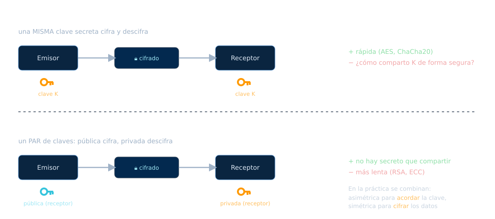
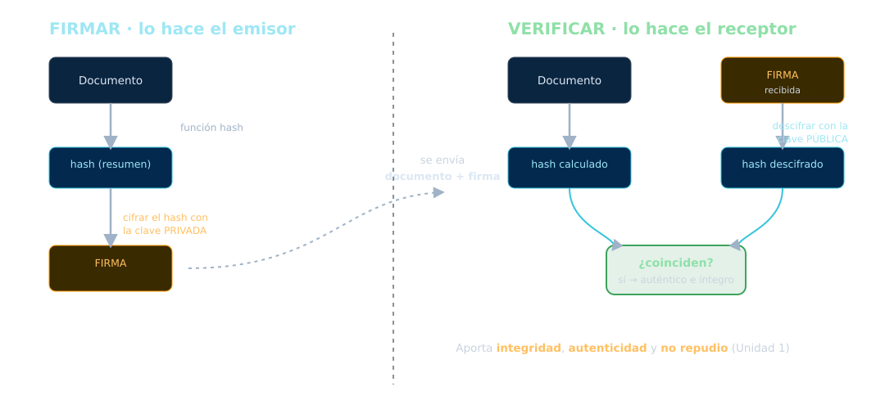
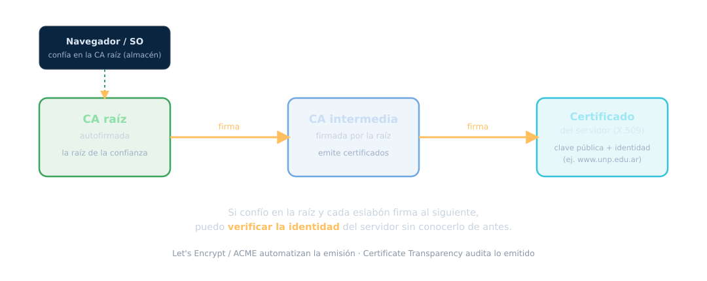

<!-- _class: portada -->
<!-- _paginate: false -->
<!-- _footer: '' -->

# Criptografía
## Unidad 6 — La defensa que atraviesa todo

ARyS · IF046 · UNPSJB Trelew · 2026

<!--
Nota del docente:
Es la unidad más conceptual y la que sostiene a las demás. Insistir en
Kerckhoffs (la seguridad vive en la clave) y en que hoy NADIE inventa su
propio cripto. El tema nuevo grande es la criptografía post-cuántica.
-->

---

## La defensa que sigue en pie cuando todo falla

A lo largo del curso apareció siempre la misma respuesta:

- ¿Sniffing (U4)? → **cifrá** el tráfico
- ¿El firewall falla (U5)? → los datos siguen **cifrados**
- ¿Robaron el disco (U2)? → **cifrado** de disco

La idea
La criptografía asume que <strong>el canal es hostil</strong> y protege la información
igual. Es la última línea, y la que atraviesa todas las demás.

---

## ¿Qué nos da la criptografía?

Los mismos pilares de la **Unidad 1**, ahora con matemática detrás:

<b>Confidencialidad</b>Cifrado: nadie más lo lee.

<b>Integridad</b>Hash: detectar si cambió.

<b>Autenticidad</b>Firma: es quien dice ser.

<b>No repudio</b>Firma: no puede negarlo.

---

## El principio de Kerckhoffs

> Un sistema debe ser seguro **aunque todo sobre él sea público, excepto la clave**.

- La seguridad vive en la **clave**, no en el secreto del algoritmo
- Los algoritmos buenos son **públicos y auditados** por el mundo entero

Regla de oro
<strong>No inventes tu propia criptografía.</strong> Usá algoritmos estándar,
revisados por décadas. El "cifrado casero" se rompe siempre.

---

## Simétrica vs. asimétrica

---

## Cifrado simétrico: bloque y flujo

### De bloque
Procesa bloques de tamaño fijo (AES: 128 bits).

### De flujo
Genera un *keystream* que se combina (XOR) con el texto (ChaCha20).

### AEAD (lo moderno)
*Authenticated Encryption*: cifra **y** autentica en una sola operación.

- **AES-GCM**
- **ChaCha20-Poly1305**

Estándar de hoy
El AEAD es lo que usan TLS 1.3, SSH y WireGuard: confidencialidad + integridad
juntas. AES: <strong>FIPS 197</strong>. ChaCha20-Poly1305: <strong>RFC 8439</strong>.

---

## Lo que ya NO se usa

<b>DES / 3DES</b>Prohibidos desde el 1/1/2024 (NIST SP 800-131A Rev.2).

<b>RC4</b>Roto; prohibido en TLS (RFC 7465).

<b>MD5 / SHA-1</b>Colisiones prácticas; fuera para firma.

Por qué importa
La criptografía <strong>caduca</strong>. Lo que era seguro hace 15 años hoy se rompe
en un servidor común. Parte del oficio es saber qué está <em>deprecado</em>.

---

## Cifrado asimétrico: RSA y ECC

Un **par** de claves: lo que cifra una, solo lo descifra la otra.

### RSA
Basado en la dificultad de **factorizar** números enormes.
Claves grandes (2048–4096 bits).

### ECC (curva elíptica)
Misma seguridad con claves **mucho más chicas**: una curva de 256 bits ≈ RSA-3072.
Más rápida y liviana.

Fuentes históricas
RSA (Rivest-Shamir-Adleman, 1978). La idea de clave pública: Diffie-Hellman, 1976.

---

## Diffie-Hellman: el truco fundamental

> Dos partes acuerdan una **clave secreta compartida** intercambiando mensajes por
> un canal **público**, sin que un espía pueda deducirla.

Es la base de casi todo el cifrado en tránsito.

Con claves efímeras → Forward Secrecy
Si usás una clave nueva por sesión (ECDHE), comprometer la clave de largo plazo
<strong>no</strong> permite descifrar las sesiones <em>pasadas</em>. TLS 1.3 lo exige.

---

## Las curvas modernas

Hoy el estándar de facto son las curvas de Bernstein, por rendimiento y resistencia
a canales laterales:

- **X25519** — para intercambio de claves (Diffie-Hellman) · RFC 7748
- **Ed25519** — para firma (EdDSA) · RFC 8032

Dato
Una clave pública Ed25519 son <strong>32 bytes</strong> y la firma 64. Comparalo con
los miles de bits de RSA. Ya está aprobada por NIST (FIPS 186-5).

---

## En la práctica: cifrado híbrido

Ni pura simétrica ni pura asimétrica. **Las dos, combinadas** — así funciona TLS:

1. **Asimétrica / DH** para **acordar** una clave de sesión (y autenticar)
2. **Simétrica (AEAD)** para **cifrar los datos**, que es rápido

Lo mejor de cada una
La asimétrica resuelve el problema de <em>compartir la clave</em>; la simétrica hace
el trabajo pesado <em>rápido</em>. Todo HTTPS que usás funciona así.

---

## Funciones de hash

Producen una **huella de tamaño fijo** de cualquier dato. Base de la integridad y
de la firma digital.

- **SHA-2** (SHA-256, SHA-512) · FIPS 180-4 — el caballo de batalla
- **SHA-3** (Keccak) · FIPS 202 — construcción distinta, alternativa robusta
- **BLAKE2 / BLAKE3** — muy rápidas (RFC 7693 / spec oficial)

Propiedad clave
<strong>Resistencia a colisiones</strong>: debe ser inviable encontrar dos entradas
con el mismo hash. Sin eso, la firma digital no vale.

---

## Hashes rotos: MD5 y SHA-1

### MD5
Colisiones prácticas desde hace años (RFC 6151). **No usar** para seguridad.

### SHA-1
Colisión real demostrada: **SHAttered** (Google/CWI, 2017).

### El calendario
NIST fijó la **eliminación total de SHA-1 para 2030**.

Si ves MD5 o SHA-1 protegiendo algo hoy, es un **hallazgo** de auditoría.

---

## Firma digital

---

## Firma digital: qué garantiza y qué dice la ley

### Garantiza
- **Integridad** — no se alteró
- **Autenticidad** — es de quien dice
- **No repudio** — no puede negarlo

### Estándar técnico
**FIPS 186-5** (2023): DSA ya no se usa para firmar; entra EdDSA.

### En Argentina
**Ley 25.506 de Firma Digital** (2001): la firma digital tiene **valor jurídico
equivalente** a la firma manuscrita.

Ojo con el término
"Firma digital" (con validez legal y certificado) no es lo mismo que "firma
electrónica" simple. La ley distingue.

---

## PKI: la cadena de confianza

---

## PKI en tu día a día

El candado del navegador es **esto** funcionando:

- Certificados **X.509** (RFC 5280) firmados por una CA
- **Let's Encrypt** + protocolo **ACME** (RFC 8555): certificados gratis y
  automáticos → masificaron HTTPS
- **Certificate Transparency** (RFC 9162): registros públicos para detectar
  certificados mal emitidos

Enganche U4
Todo esto es lo que hace que el sniffing (U4) vea solo tráfico cifrado: la PKI
autentica al servidor y habilita el cifrado.

---

## Correo cifrado: PGP y S/MIME

### PGP / GnuPG
Red de confianza (*web of trust*).
Modernizado en **RFC 9580 (2024)**.

### S/MIME
Usa certificados **X.509 / PKI**.
RFC 8551.

Mismo par de claves
Ciframos con la <strong>pública</strong> del destinatario (solo él lo lee) y firmamos
con <strong>nuestra privada</strong> (prueba que fuimos nosotros).

---

## Esteganografía

> Criptografía oculta el **contenido**. Esteganografía oculta la **existencia**.

- Esconder un mensaje dentro de una imagen, audio o video
- Complementaria, no sustituta: se puede **cifrar y además esconder**

Dónde aparece
Marcas de agua, exfiltración de datos, canales encubiertos. Un cifrado se
<em>ve</em> (hay tráfico cifrado); un mensaje esteganografiado, no.

---

## Protocolos que usás todos los días

<b>TLS 1.3</b>El candado de la web. RFC 8446 → actualizado por RFC 9846 (2026).

<b>SSH</b>Administración remota segura. RFC 4251.

<b>IPsec</b>VPN a nivel de red. RFC 4301 (+ IKEv2).

<b>WireGuard</b>VPN moderno, minimalista, en el kernel Linux.

Todos aplican lo mismo
DH para acordar clave + AEAD para cifrar + firma/certificados para autenticar. Los
ladrillos son los que vimos; cambia el ensamblaje.

---

<!-- _class: portada -->
<!-- _paginate: false -->
<!-- _footer: '' -->

# La amenaza cuántica
## Criptografía post-cuántica (PQC)

Lo que viene a cambiar toda la criptografía asimétrica

---

## El problema: el algoritmo de Shor

Casi toda la criptografía **asimétrica** de hoy (RSA, ECC) se apoya en problemas
matemáticos difíciles: factorizar, logaritmo discreto.

Una **computadora cuántica** suficientemente grande, con el **algoritmo de Shor**
(1994), los resuelve **eficientemente**. Adiós RSA y ECC.

"Harvest now, decrypt later"
La máquina todavía no existe… pero un atacante puede <strong>capturar hoy</strong>
tráfico cifrado y guardarlo para <strong>descifrarlo mañana</strong>, cuando la
cuántica llegue. Por eso migrar es urgente <em>ahora</em>.

---

## La respuesta: los estándares NIST 2024

En **agosto de 2024**, NIST publicó los primeros tres estándares de criptografía
post-cuántica (algoritmos que **resisten** a Shor):

<b>FIPS 203 · ML-KEM</b>Intercambio de claves (Kyber). Reemplaza a RSA/ECDH.

<b>FIPS 204 · ML-DSA</b>Firma digital (Dilithium).

<b>FIPS 205 · SLH-DSA</b>Firma basada en hash (SPHINCS+), respaldo conservador.

Nota de honestidad
La simétrica (AES) y los hash <strong>no</strong> se rompen con la cuántica (solo se
debilitan; se compensa con claves más largas). El impacto fuerte es sobre la
<strong>asimétrica</strong>.

---

## Cerrando la unidad

1. La criptografía asume el canal **hostil** y protege igual
2. **Kerckhoffs**: la seguridad vive en la clave; no inventes tu propio cripto
3. **Simétrica** (AES/AEAD) rápida · **asimétrica** (RSA/ECC) resuelve compartir clave
4. En la práctica: **híbrido** (DH acuerda, simétrica cifra) — así funciona TLS
5. **Hash** para integridad; **firma digital** para autenticidad y no repudio (Ley 25.506)
6. La **PKI** liga identidad y clave; es el candado de la web
7. Se viene la **criptografía post-cuántica** (FIPS 203/204/205, 2024)

Próxima unidad
<strong>Unidad 7 — Sistemas de Autenticación.</strong> Ya sabemos proteger el mensaje;
ahora, cómo probar <em>quién</em> es cada uno: contraseñas, Kerberos, MFA.

---

<!-- _class: portada -->
<!-- _paginate: false -->
<!-- _footer: '' -->

# ¿Preguntas?

Material: github.com/bzappellini/ARyS · Campus virtual UNPSJB

