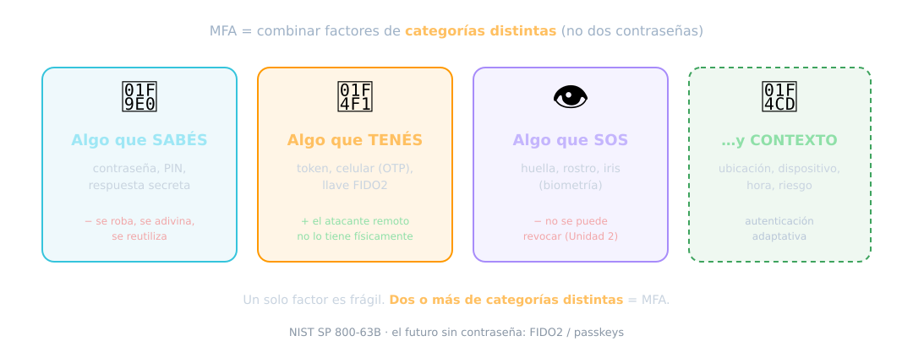
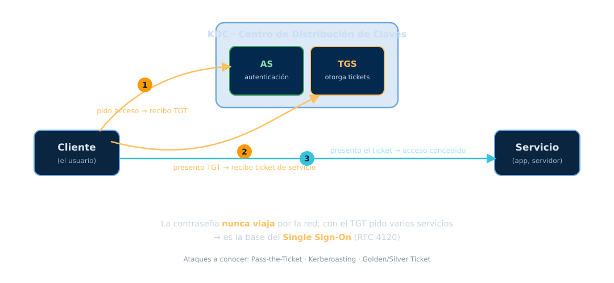
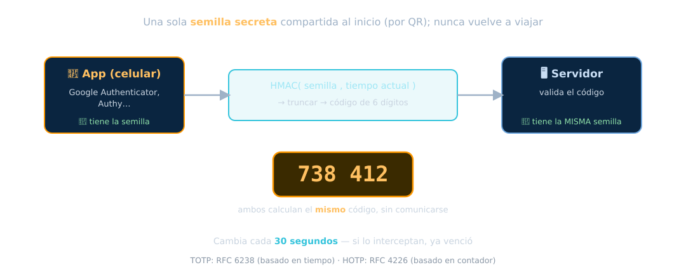

<!-- _class: portada -->
<!-- _paginate: false -->
<!-- _footer: '' -->

# Sistemas de Autenticación
## Unidad 7 — Probar quién es cada uno

ARyS · IF046 · UNPSJB Trelew · 2026

<!--
Nota del docente:
De proteger el mensaje (U6) a probar la identidad. Eje moderno: el mundo va
hacia passwordless (passkeys/FIDO2). OTP (HOTP/TOTP) es parte central de MFA.
Actualizar: NIST 800-63B-4 (2025) reemplaza a la guía de 2017.
-->

---

## De proteger el mensaje a probar quién sos

En la **Unidad 6** aprendimos a proteger la información. Pero antes de dar acceso
hay una pregunta previa:

> ¿Cómo sé que **sos quien decís ser**?

El problema
Todo el cifrado del mundo no sirve si le abrís la puerta al atacante porque
<em>se hizo pasar</em> por un usuario legítimo. La autenticación es esa puerta.

---

## AAA: tres cosas distintas

<b>Authentication</b>¿Quién sos? Probar la identidad.

<b>Authorization</b>¿Qué podés hacer? Permisos una vez dentro.

<b>Accounting</b>¿Qué hiciste? Registro y auditoría.

No confundir
Autenticar (probar identidad) ≠ autorizar (dar permisos). Podés estar autenticado
y <strong>no</strong> tener permiso para algo. Zero Trust (U5) exige verificar las
tres, siempre.

---

## Los factores de autenticación

---

## El factor más débil: la contraseña

"Algo que sabés" es lo más usado… y lo más frágil:

- Se **reutiliza** entre sitios (una fuga, muchas cuentas caídas)
- Se **adivina**, se **roba**, se **phishea**
- El humano elige contraseñas malas

Credential stuffing
Con bases de contraseñas filtradas, el atacante prueba automáticamente esas mismas
credenciales en cientos de sitios. Por eso <strong>no reutilizar</strong> es tan
importante.

---

## Cómo se guardan las contraseñas

> **Nunca** en texto plano. Si te roban la base, no deben poder leerlas.

Se guarda un **hash** (Unidad 6), pero con dos agregados:

- **Sal** única por usuario → derrota las *rainbow tables*
- **Función lenta y con costo de memoria** → encarece el crackeo offline

Las tres modernas
<strong>bcrypt</strong>, <strong>scrypt</strong> y <strong>Argon2</strong> (ganador
del Password Hashing Competition; RFC 9106, variante Argon2id por defecto). Un
SHA-256 pelado <em>no alcanza</em>: es demasiado rápido de crackear.

---

## Ataques a las contraseñas

<b>Fuerza bruta</b>Probar todas las combinaciones.

<b>Diccionario</b>Probar listas de comunes (rockyou).

<b>Rainbow tables</b>Hashes precalculados (la sal las anula).

<b>Credential stuffing</b>Reusar credenciales filtradas.

Enganche U3
El crackeo offline (John, Hashcat) lo vimos en Hacking Ético. Por eso el hash tiene
que ser <strong>lento</strong>: cada intento cuesta.

---

## Lo que hoy recomienda NIST

La guía vigente (**NIST SP 800-63B-4**, 2025) cambió el sentido común viejo:

### Sí
- **Longitud** sobre complejidad (mín. 8, hasta ≥64)
- Chequear contra listas de **comprometidas**
- Permitir gestores de contraseñas

### No
- **No** forzar reglas de composición
- **No** forzar rotación periódica sin motivo
- **No** preguntas "secretas"

Ojo
Mucho de lo que te enseñaron ("cambiala cada 90 días", "poné un símbolo") hoy está
<strong>desaconsejado</strong>. La guía cambió; el material viejo quedó atrás.

---

## Autenticación basada en tickets: Kerberos

---

## Por qué importa Kerberos

Es la base de la autenticación en **Active Directory** y en muchísimas redes
corporativas.

- La **contraseña nunca viaja** por la red
- Un solo login → **SSO**: el TGT sirve para pedir muchos servicios
- Tickets con **tiempo de vida** limitado

Ataques a conocer
<strong>Pass-the-Ticket</strong> (robar y reusar tickets), <strong>Kerberoasting</strong>
(crackear offline claves de cuentas de servicio), <strong>Golden/Silver Ticket</strong>
(falsificar tickets con el hash de <code>krbtgt</code>). Fuente: RFC 4120.

---

<!-- _class: portada -->
<!-- _paginate: false -->
<!-- _footer: '' -->

# Más de un factor
## MFA y contraseñas de un solo uso

Porque un solo factor no alcanza

---

## Autenticación multifactor (MFA)

> Combinar **dos o más factores de categorías distintas**.

- Contraseña **+** código del celular (algo que sabés + algo que tenés)
- Aunque te roben la contraseña, **falta el segundo factor**

La regla
Dos contraseñas <strong>no</strong> son MFA (misma categoría). Tiene que ser de
<em>tipos distintos</em>: saber + tener + ser.

---

## OTP: contraseñas de un solo uso

---

## HOTP y TOTP

### HOTP
Basado en un **contador** que avanza con cada uso.

`código = HMAC(secreto, contador)`

RFC 4226

### TOTP
Basado en el **tiempo** (ventanas de ~30 s). Es lo que usan Google Authenticator,
Authy.

`código = HMAC(secreto, tiempo)`

RFC 6238

La clave
El secreto se comparte <strong>una sola vez</strong> (por QR). Después, ambos lados
calculan el mismo código <strong>sin comunicarse</strong>. Si interceptan el código,
ya venció.

---

## OTP por SMS: mejor que nada, pero débil

Recibir el código por SMS es popular… y **problemático**:

- **SIM swapping**: el atacante secuestra tu número
- Intercepción en la red (SS7), phishing en tiempo real

Postura de NIST
En <strong>NIST SP 800-63B-4</strong>, el OTP por SMS es un <em>"restricted
authenticator"</em>: se puede usar, pero con evaluación de riesgo y plan de
migración. Preferí una <strong>app TOTP</strong> o una <strong>llave FIDO2</strong>.

---

## Cuando el segundo factor también falla

**MFA fatigue / prompt bombing**: el atacante que **ya tiene tu contraseña** dispara
decenas de notificaciones push hasta que aprobás por cansancio o error.

Caso real
Así entraron a <strong>Uber en 2022</strong>. Mitigación: <strong>number
matching</strong> (tenés que tipear un número que muestra la pantalla), límites de
tasa, y factores <strong>resistentes a phishing</strong> (FIDO2).

---

<!-- _class: portada -->
<!-- _paginate: false -->
<!-- _footer: '' -->

# El futuro sin contraseña
## FIDO2 · WebAuthn · Passkeys

La actualización que está reemplazando a la contraseña

---

## Autenticación sin contraseña

En lugar de un secreto compartido, **criptografía de clave pública** (Unidad 6):

- Tu dispositivo genera un **par de claves por sitio**
- La **privada nunca sale** del dispositivo; **firma un desafío** del servidor
- El servidor solo guarda tu **clave pública** → si lo hackean, no hay contraseñas
  que robar

Resistente a phishing por diseño
La firma está <strong>ligada al dominio</strong>: una web falsa no puede reutilizarla.
Es la diferencia estructural con la contraseña y el OTP.

---

## FIDO2 y passkeys

### FIDO2
El estándar: **WebAuthn** (API del navegador, W3C) **+ CTAP2** (dispositivo).

WebAuthn **Level 2** es la recomendación estable; Level 3 está en camino.

### Passkeys
La versión de consumo masivo: credenciales FIDO **sincronizables** por la nube
(Apple, Google, Microsoft).

Resolvió el problema de "¿y si pierdo el dispositivo?".

Por qué reemplazan a la contraseña
No se reutilizan, no se filtran del servidor, no se phishean. NIST 800-63B-4 ya las
respalda como <em>"syncable authenticators"</em>.

---

## Federación: iniciar sesión con otro

El botón "Iniciar sesión con Google/Microsoft". Tres estándares que conviene no
mezclar:

<b>OAuth 2.0</b>AUTORIZACIÓN: delegar acceso a recursos. "Qué podés hacer". RFC 6749.

<b>OpenID Connect</b>AUTENTICACIÓN sobre OAuth: agrega el ID Token. "Quién sos".

<b>SAML 2.0</b>Federación enterprise (XML), SSO corporativo. OASIS.

Error clásico
Usar <strong>OAuth "pelado" para login</strong>. OAuth es autorización, no
autenticación. Para "quién sos" va <strong>OpenID Connect</strong>.

---

## AAA de red: RADIUS y TACACS+

Para autenticar acceso a la **red** y a los **equipos** (engancha con Redes):

### RADIUS
UDP; junta autenticación y autorización. Cifra **solo la contraseña**.
Uso: Wi-Fi 802.1X, VPN. RFC 2865.

### TACACS+
Origen Cisco, TCP; cifra **todo** el paquete y **separa** las tres A.
Uso: administración de dispositivos. RFC 8907 (Informational).

---

## Hacia dónde va todo

Dos fuerzas que ya vimos, aplicadas a la identidad:

- **Passwordless**: eliminar la contraseña como secreto compartido → passkeys
- **Zero Trust** (Unidad 5): la autenticación deja de ser un evento único de login y
  pasa a ser **verificación continua y adaptativa** según el **riesgo**

Autenticación adaptativa
Si algo cambia (dispositivo nuevo, país raro, hora inusual), el sistema pide
<strong>re-autenticación</strong> (step-up). El contexto también es un factor.

---

## Cerrando la unidad

1. **AAA**: autenticar ≠ autorizar ≠ registrar
2. Factores: algo que **sabés / tenés / sos** (+ contexto); MFA los combina
3. Contraseñas: **hash + sal + función lenta** (Argon2); NIST cambió las reglas
4. **Kerberos**: SSO con tickets, sin mandar la contraseña (y sus ataques)
5. **OTP**: HOTP (contador) y TOTP (tiempo); SMS es débil
6. **Passkeys / FIDO2**: sin contraseña, clave pública, **resistente a phishing**
7. Federación: **OAuth** (autoriza) vs **OpenID Connect** (autentica) vs SAML

Próxima unidad
<strong>Unidad 8 — Herramientas de Monitoreo.</strong> Ya controlamos quién entra;
ahora, cómo <em>vigilar</em> que todo siga sano: SNMP, Syslog, gestión de red.

---

<!-- _class: portada -->
<!-- _paginate: false -->
<!-- _footer: '' -->

# ¿Preguntas?

Material: github.com/bzappellini/ARyS · Campus virtual UNPSJB

