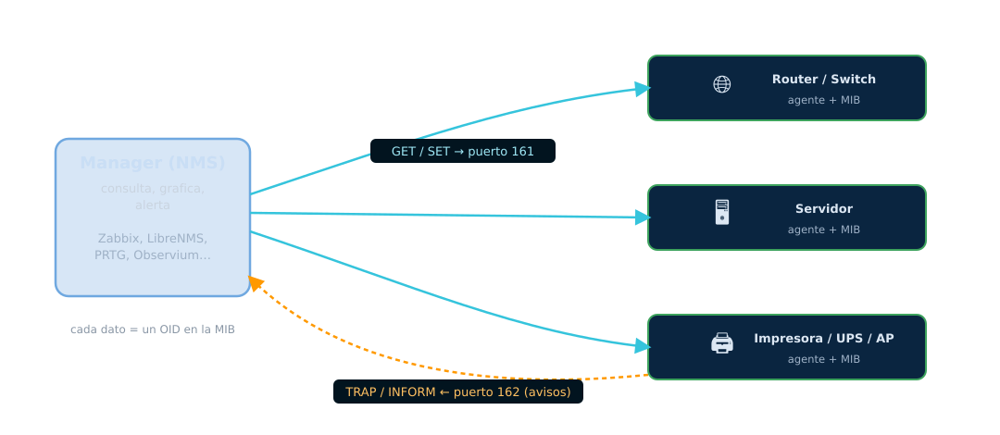
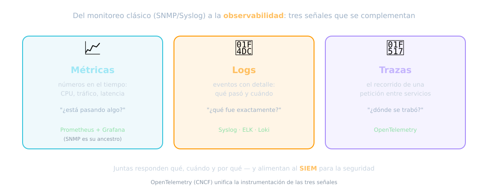
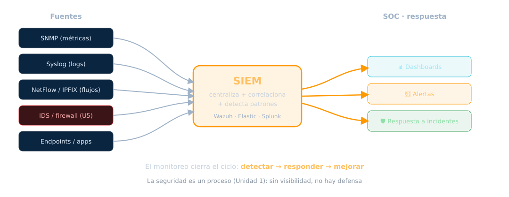

<!-- _class: portada -->
<!-- _paginate: false -->
<!-- _footer: '' -->

# Herramientas de Monitoreo
## Unidad 8 — Ver para poder defender

ARyS · IF046 · UNPSJB Trelew · 2026

<!--
Nota del docente:
Última unidad. Cierra el ciclo de la seguridad como proceso (U1). Ejes:
SNMP (y por qué solo v3 es seguro, enganche con Sniffing), Syslog, y la
observabilidad moderna (métricas/logs/trazas → SIEM). Cerrar recapitulando
todo el curso.
-->

---

## De controlar a vigilar

En la **Unidad 7** decidimos **quién entra**. Pero una red no se administra a
ciegas: hay que **verla** para saber si está sana, si rinde y si la están atacando.

> Sin **visibilidad**, no hay defensa. No podés proteger lo que no ves.

El cierre del ciclo
Esta unidad completa la idea de la <strong>Unidad 1</strong>: la seguridad es un
<em>proceso</em>. Monitorear es la fase que permite <strong>detectar, responder y
mejorar</strong>.

---

## Gestión de red: el modelo FCAPS

El marco clásico (ISO / ITU-T) organiza la gestión en **cinco áreas**:

<b>F — Fault</b>Fallas: detectar y resolver caídas.

<b>C — Configuration</b>Configuración de los equipos.

<b>A — Accounting</b>Uso y contabilidad de recursos.

<b>P — Performance</b>Rendimiento: latencia, tráfico, capacidad.

<b>S — Security</b>Seguridad de la gestión.

Fuente
FCAPS viene del modelo de gestión OSI (ITU-T X.700 / ISO 7498-4); las funciones TMN
están en ITU-T M.3400. Un <strong>NMS</strong> cubre estas áreas.

---

## SNMP: la arquitectura

---

## SNMP: cómo está organizado

- **Manager** (NMS) ↔ **Agente** (en cada dispositivo)
- La **MIB** (Management Information Base) es el árbol de datos; cada dato es un
  **OID** (identificador de objeto)
- Operaciones: **GET / GETNEXT / GETBULK** (leer), **SET** (escribir),
  **TRAP / INFORM** (el agente avisa)
- Puertos: **UDP 161** (agente) y **162** (traps al manager)

Fuentes
SNMPv1: RFC 1157 · estructura de la MIB (SMIv2): RFC 2578 (STD 58) · operaciones:
RFC 3416.

---

## SNMP: las versiones importan (mucho)

### v1 y v2c ✗
La *community string* (la "contraseña") viaja **en texto plano**.

Un sniffer (Unidad 4) la lee y toma el control de la gestión.

### v3 ✓
**Autenticación** (HMAC) y **cifrado** vía el modelo **USM**.
Protección anti-replay.

La **única** versión segura.

Hallazgo de auditoría clásico
Encontrar SNMP <strong>v2c con community "public"</strong> es de los primeros
hallazgos en cualquier pentest. Fuentes: arquitectura v3 RFC 3411 (STD 62), USM
RFC 3414.

---

## Syslog: el estándar de logging

Transporta mensajes de **eventos** desde los dispositivos a un colector central.

- **Severidades**: de **0 (Emergency)** a **7 (Debug)**
- **Transporte**: UDP 514 (clásico) · TCP · **TLS (TCP 6514)** para logging seguro

Por qué TLS
Los logs contienen información sensible <em>y</em> son evidencia. Sin cifrado, un
atacante los lee o los altera. Fuentes: RFC 5424 (protocolo), RFC 5425 (TLS).

---

## Centralizar los logs

Un log **solo en el equipo** sirve de poco:

- Si el atacante entra, **borra sus huellas** (Unidad 3, fases 4-5)
- Con logs **centralizados y protegidos**, borrarlos es mucho más difícil
- Además, permite **correlacionar** eventos de toda la red

Enganche
Esto es lo que hace que "borrar huellas" sea difícil: el log ya salió del equipo
comprometido. El monitoreo es la contramedida directa.

---

## Monitoreo de flujos: NetFlow / IPFIX

Además de métricas y logs, se analizan los **flujos**: metadatos de *quién habló con
quién, por qué puerto y cuánto*, **sin ver el contenido**.

- Base para **detección de anomalías**, *capacity planning* y forense
- **NetFlow** (Cisco) → **IPFIX** (el estándar IETF, RFC 7011, STD 77)

Enganche U4
En el mundo cifrado, los <strong>metadatos de flujo</strong> son gran parte de lo que
se puede analizar — lo mismo que vimos en Sniffing.

---

<!-- _class: portada -->
<!-- _paginate: false -->
<!-- _footer: '' -->

# La observabilidad moderna
## Métricas, logs y trazas

Del polling SNMP a la pila cloud-native

---

## Los tres pilares de la observabilidad

---

## El stack moderno

### Métricas
**Prometheus** — series temporales, modelo *pull*. El SNMP de hoy en
infraestructura cloud-native.

**Grafana** — los dashboards.

### Logs y trazas
**ELK / Loki** para logs.

**OpenTelemetry** (CNCF): estándar que **unifica** la instrumentación de las tres
señales.

Idea
El concepto es el mismo que SNMP/Syslog: <strong>recolectar, almacenar, graficar,
alertar</strong>. Cambian las herramientas y la escala, no el objetivo.

---

<!-- _class: portada -->
<!-- _paginate: false -->
<!-- _footer: '' -->

# Monitoreo y seguridad
## SIEM y SOC

Donde el monitoreo alimenta la defensa

---

## El pipeline: de las fuentes al SOC

---

## SIEM: la sala de control

Un **SIEM** (Security Information and Event Management) **centraliza** logs y eventos
de toda la infraestructura para **correlacionar** y **detectar** incidentes.

- Reúne SNMP, Syslog, flujos, IDS (Unidad 5), endpoints…
- Correlaciona: "este login raro **+** este escaneo **+** esta transferencia" = alerta
- Se opera desde un **SOC** (Security Operations Center)

Herramientas
<strong>Wazuh</strong> (open source), Elastic Security, Splunk. El SIEM es donde
convergen casi todas las unidades del curso.

---

## El monitoreo cierra el ciclo

La seguridad es un **proceso** (Unidad 1), y el monitoreo es lo que lo sostiene:

**Detectar → Responder → Mejorar → (y de nuevo)**

- Sin **detección**, no hay respuesta a incidentes
- Sin **evidencia** (logs), no hay investigación ni aprendizaje
- La tendencia: **AIOps** y detección de anomalías por ML sobre el volumen de datos

Fuente
El ciclo de respuesta a incidentes: NIST SP 800-61 Rev. 3.

---

<!-- _class: portada -->
<!-- _paginate: false -->
<!-- _footer: '' -->

# El recorrido completo
## Lo que aprendimos en ARyS

Las 8 unidades, una sola historia

---

## Todo se conecta

1. **Conceptos** — CIA, riesgo, controles
2. **Física** — el primer perímetro
3. **Hacking ético** — pensar como el atacante
4. **Sniffing** — escuchar la red

5. **Firewall/IDS** — controlar y detectar
6. **Criptografía** — proteger la información
7. **Autenticación** — probar quién es cada uno
8. **Monitoreo** — ver para defender

La idea que atraviesa todo
La seguridad no es un producto: es un <strong>proceso</strong> que se diseña, se
sostiene y se mejora. Administrar y asegurar son la misma tarea.

---

## Lo que se llevan

1. **Pensar en riesgo**, no en miedo: qué proteger y de qué
2. **Defensa en profundidad**: nunca un solo control
3. **Atacar para defender**, siempre con ética y autorización
4. **Cifrar** asumiendo que el canal es hostil
5. **Autenticar** bien: el futuro es passwordless
6. **Monitorear** para detectar, responder y mejorar

Y sobre todo
Conceptos antes que herramientas. Las herramientas cambian cada año; los
<strong>fundamentos</strong> que vieron acá, no. Sigan aprendiendo.

---

<!-- _class: portada -->
<!-- _paginate: false -->
<!-- _footer: '' -->

# ¡Gracias!
## Fin del curso · ARyS 2026

Material: github.com/bzappellini/ARyS · Campus virtual UNPSJB

